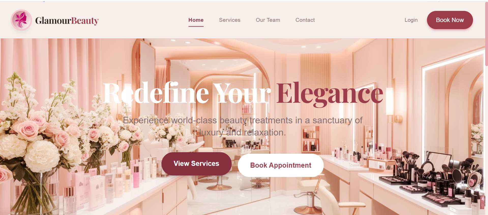
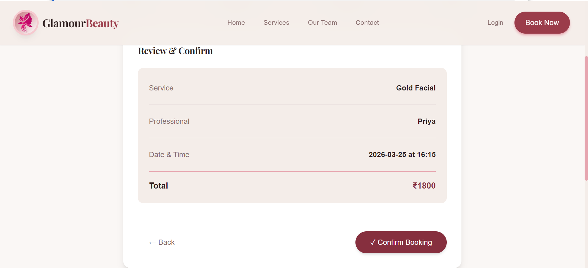
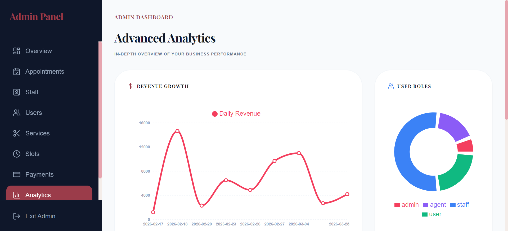
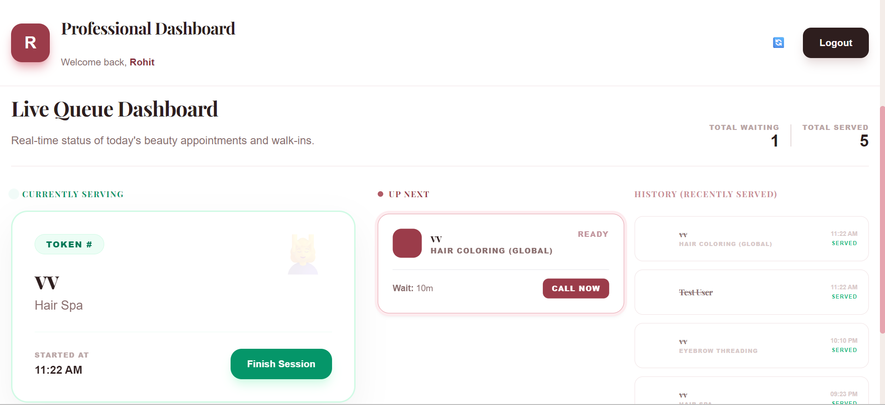
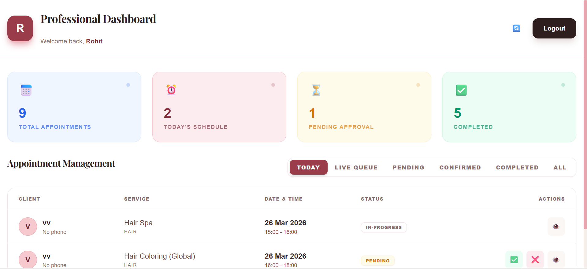
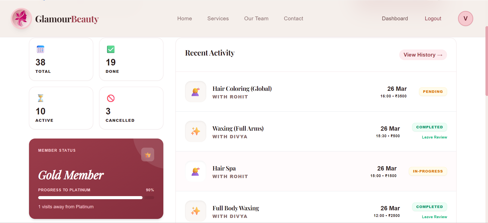
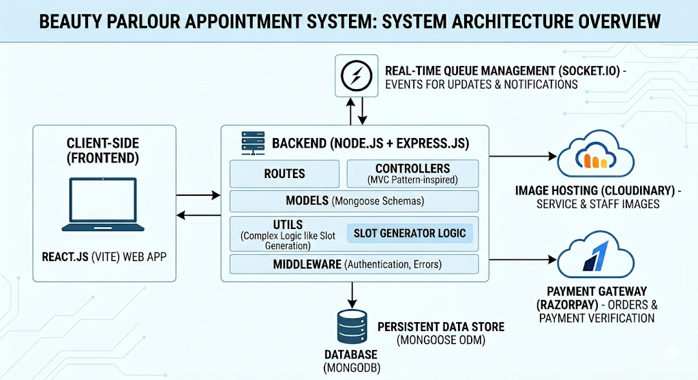

# 💅 Beauty Parlour Appointment System
### *A Full-Stack MERN Application with Hybrid AI Chatbot, Real-Time Queue Management & Slot Booking*

[](https://github.com/your-username/qa-appointment-system)
[](https://nodejs.org/)
[](https://reactjs.org/)
[](LICENSE)

A **production-ready MERN stack application** designed to streamline beauty parlour operations with:

- 📅 Smart appointment booking with slot & queue management
- 🤖 Hybrid AI chatbot for conversational booking  
- 💳 Secure Razorpay payments & automated refunds
- ⏱️ Real-time queue system using Socket.IO / WebSockets  
- 📊 Admin, Staff & User role-based dashboards

👉 Built to simulate a **real-world scalable SaaS product**

---

## 🌐 Live Demo

🚧 Deployment in progress (will be available soon)

👉 Meanwhile, run locally using setup guide below.

---

## 🚀 Key Highlights & Features

### 🤖 Hybrid AI Chatbot (Backend-Controlled)

- Designed a hybrid chatbot combining AI intent detection with a backend-driven state machine
- AI is used only for understanding user input (intent extraction), ensuring minimal API usage
- All booking logic (services, staff, slots, appointments) is handled directly by backend for reliability
- Supports conversational booking as well as guided step-by-step interaction
- Eliminates rate limit issues and improves performance compared to full AI-agent systems

### 📅 Smart Appointment Booking

- Slot-based booking system with admin-generated time slots (staff + service + date)
- Real-time appointment status tracking (Pending, Queued, Confirmed, Completed, Cancelled)
- Queue visibility after booking to track position and progress
- Conflict detection to prevent double-booking
- Service catalog with duration, pricing, category, and staff mapping

### 💳 Payments & Refunds
- Razorpay integration for secure online payments
- Automated refunds with instant slot release on cancellation
- Invoice generation for completed bookings

### ⏱️ Real-time Queue System
- Live appointment status updates using Socket.IO WebSockets
- Sync across Admin, Staff, and User dashboards in real-time
- Queue-like position visibility after booking (Pending / Queued / Confirmed / Completed / Cancelled)

### 📊 Role-Based Dashboards
- Admin: Revenue analytics, booking trends, staff scheduling, service management, slot generation
- Staff: Personal schedule, appointment status updates, real-time queue view
- Customer: Service browsing, booking history, queue position tracking
---

## 📸 Screenshots & Visuals

### 🏠 Landing Page

*A modern, responsive landing page designed to showcase services and drive user engagement through clear call-to-actions.*

### 📅 Booking Flow

*A seamless, step-by-step booking experience with real-time slot availability and instant confirmation.*

### 🛠️ Admin Analytics

*An analytics dashboard providing insights into revenue, appointments, and user growth through interactive visualizations*

### 🚦 Real-time Queue Board

*A real-time queue management system with token calling, live status updates, and tracking of active and upcoming appointments*

### 👨‍💼 Staff Dashboard

*Staff can manage appointments, view schedules, and update status in real-time.*

### 👤 User Booking History

*Users can track bookings, history, and upcoming appointments.*

### 🎬 1-Minute Demo Video
![Full Booking Demo] - (https://drive.google.com/file/d/1yBQ0XyBk2IwEkQSTuf5JMKDSzCSZJ8pj/view?usp=drive_link)
*End-to-end booking flow including slot selection, payment, confirmation, and live queue system.*

---

## 🛠️ Tech Stack

### Frontend
- **Framework**: React 18 (Vite)
- **Styling**: Tailwind CSS (Utility-first design)
- **State**: React Context API (Auth & Global State)
- **Real-time**: Socket.IO Client
- **Charts**: Recharts (Data visualization)
- **Icons**: Lucide React

### Backend
- **Framework**: Node.js & Express 5
- **Database**: MongoDB (Mongoose ODM)
- **Real-time**: Socket.IO (WebSockets)
- **Auth**: JWT (JSON Web Tokens) & Bcrypt.js
- **Payment**: Razorpay SDK
- **Storage**: Cloudinary (Image management)
- **Security headers**: Helmet, CORS

### AI & Automation
- AI Intent Detection (lightweight usage for natural language understanding)
- Backend State Machine (controls chatbot flow and booking logic)

---

## 🏗️ System Architecture



- The system follows a decoupled **Client–Server Architecture** with a centralized API layer.
- The backend is built using Node.js and Express with a controller–service–model pattern, ensuring scalability and maintainability.
- Real-time updates are handled using WebSockets (Socket.IO) for queue and appointment status synchronization across clients.
- The chatbot is implemented using a backend-driven state machine for reliable booking flow
- AI is used only for intent detection (not for business logic execution)

---

## 🧠 Chatbot Design

This project uses a hybrid chatbot architecture:

- AI is used only for understanding user intent (natural language)
- Backend handles all business logic and booking flow
- Ensures:
  - High reliability
  - No API rate limit issues
  - Faster response time
  - Deterministic booking process

This approach is more production-ready compared to full AI-agent systems.

---

## 📂 Project Structure

```bash
qa-appointment-system/
├── client/                 # React Frontend (Vite)
│   ├── src/
│   │   ├── api/            # Centralized API service layer
│   │   ├── components/     # Atomic UI components
│   │   ├── context/        # Auth & Global State Providers
│   │   ├── pages/          # Routed page components
│   │   └── hooks/          # Custom business logic hooks
│   └── .env.example        # Client environment template
│
├── server/                 # Express Backend (Node.js)
│   ├── src/
│   │   ├── controllers/    # Business logic handlers
│   │   ├── models/         # Mongoose Data Schemas
│   │   ├── routes/         # API Endpoint Definitions
│   │   ├── middleware/     # Auth, validation, error handling
│   │   ├── socket/         # Real-time event handlers (SocketIO)
│   │   └── utils/          # Helpers (Cloudinary, token logic)
│   └── createBotUser.js    # Script to create real bot user 
│   └── .env.example        # Server environment template
│   └── server.js           # App entry point
│
└── docs/                   # Architecture,Screenshots
```

---
 
## 🔑 Demo Credentials

| Role | Email | Password |
|------|-------|----------|
| **Admin** | `admin@beautyparlour.com` | `admin123` |
| **Staff** | `staffname@example.com` | `password123` |
| **User** | `user@gmail.com` | `password` |

---

## 🚀 Getting Started

### 1. Prerequisites
- Node.js (v20 or higher)
- MongoDB Atlas account (or local MongoDB)
- Razorpay & Cloudinary API Keys

### 2. Clone & Install
```bash
git clone https://github.com/kavyanerella65/beauty-parlour-appointment-system.git
cd qa-appointment-system
npm run install:all
```

### 3. Environment Configuration
Create `.env` files in both `client` and `server` directories following the respective `.env.example` templates.

**Server `.env` Highlights:**
```env
MONGO_URI=your_mongodb_uri
JWT_SECRET=your_jwt_secret
CLOUDINARY_CLOUD_NAME=name
RAZORPAY_KEY_ID=rzp_test_xxx
CLIENT_URL=http://localhost:5173
```

**Client `.env` Highlights:**
```env
VITE_BACKEND_URL=https://beauty-parlour-appointment-system.onrender.com
VITE_RAZORPAY_KEY_ID=rzp_test_xxx
```

### 4. Run Development
```bash
# This concurrently starts both React and Express
npm run dev
```

### 5. Chatbot Setup

- The chatbot is built into the backend using a state machine architecture
- No external workflow setup required

---

### Generate Slots (Admin Panel)
Before the chatbot can book appointments, slots must be pre-generated:

- Log in as Admin → go to Slots section
- Select staff member, service, and date
- Click Generate Slots
- Repeat for each staff + service + date combination

## 📡 API Overview (Brief)

| Endpoint | Method | Description |
|----------|--------|-------------|
| `/api/auth` | `POST` | User registration & Authentication |
| `/api/services` | `GET/POST` | Catalog management |
| `/api/slots` | `GET` | Availability tracking |
| `/api/appointments` | `POST/PATCH` | Booking & Status management |
| `/api/payment` | `POST` | Razorpay order & verification |
| `/api/queue` | `GET/PUT` | Real-time queue control |

---

## 👤 User Roles

| Role | Capabilities |
|------|--------------|
| **Customer** | Browse services, book slots, pay securely, track queue position. |
| **Staff** | Manage personal schedule, update service status, view appointments. |
| **Admin** | Full system control, analytics access, financial exports, RBAC management. |

---

## 🚢 Deployment

- **Frontend**: Recommended deployment on Vercel or Netlify.
- **Backend**: Recommended deployment on Render or Railway.
- **Database**: MongoDB Atlas for cloud persistence.
- **Static Files**: Cloudinary handles all media storage.

---

## 🤝 Contributing

We welcome contributions! Please follow these steps:
1. Fork the Project.
2. Create your Feature Branch (`git checkout -b feature/AmazingFeature`).
3. Commit your Changes (`git commit -m 'Add some AmazingFeature'`).
4. Push to the Branch (`git push origin feature/AmazingFeature`).
5. Open a Pull Request.

---

## 📄 License
Distributed under the ISC License. See `LICENSE` for more information.

---

## ⚠️ Security Notes
- **Environment Variables**: Never commit `.env` files to source control.
- **API Security**: Implemented Helmet for secure headers and Rate-Limiting to prevent brute-force attacks.
- **CORS**: Configured to allow only trusted origin requests in production.

---

## 🚀 Key Engineering Decisions

- Replaced AI-agent workflow with backend-driven chatbot architecture
- Reduced API usage drastically by limiting AI calls to intent detection only
- Designed scalable slot and queue-based booking system
- Implemented real-time updates using WebSockets

---

## 🔮 Future Improvements
- [ ] **AI-Powered Recommendations**: Suggest services based on user history.
- [ ] **Native Mobile App**: React Native version for iOS and Android.
- [ ] **Multi-language Support (i18n)**: Expanding accessibility.
- [ ] **Advanced Scheduling**: Integrating with Google Calendar API.

---

## ⭐ Support
If you found this project helpful, consider giving it a star ⭐